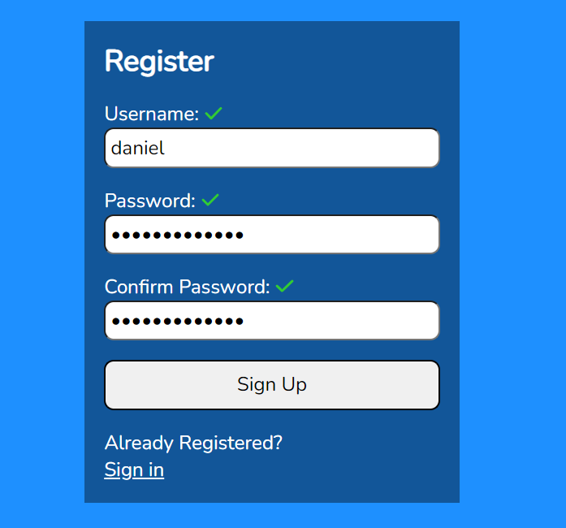

## Form Validation Template

To install: npm install

To run server: npm run dev

UseEffect and useState hooks were used. Can be used with axios to validate against endpoint while using react router to navigate success page after validation.

